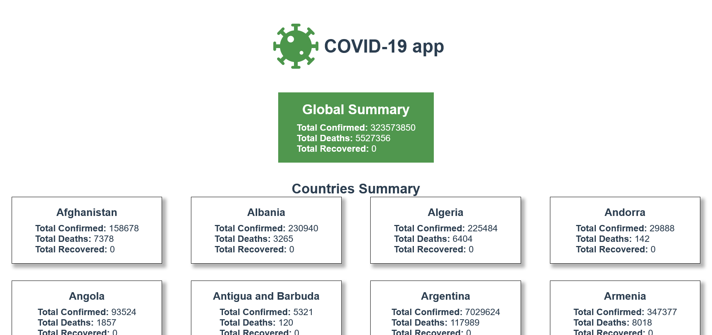
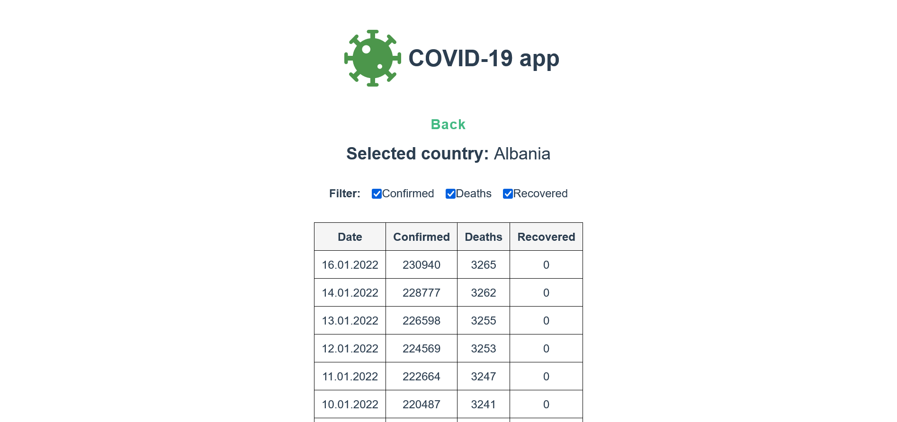
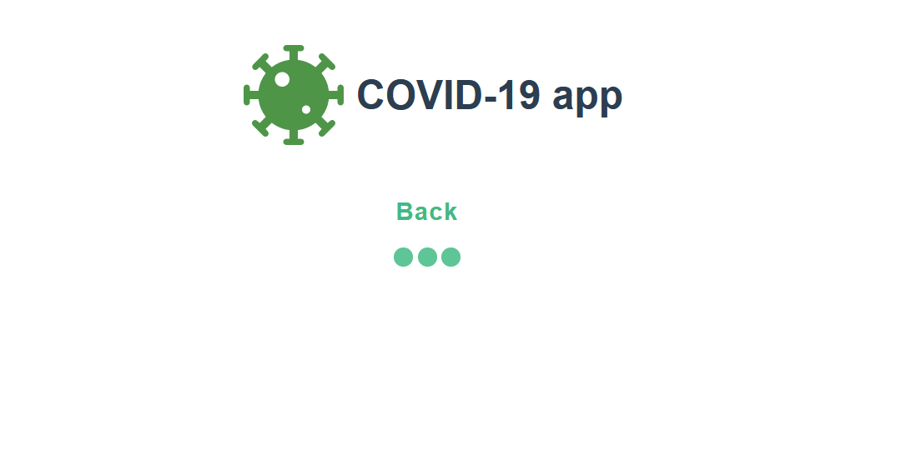
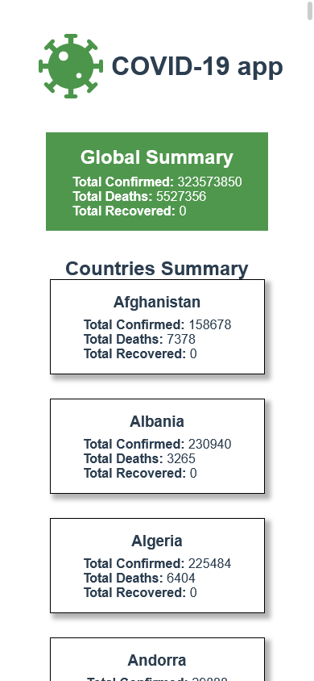
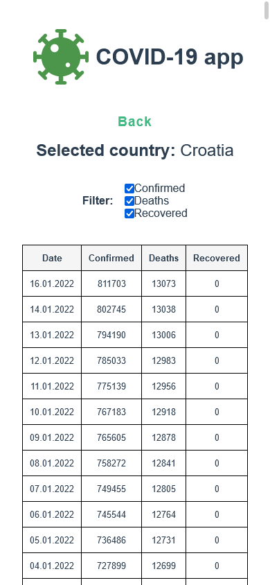

# COVID Data Worldwide

This is a vue.js single-page application that displays current data on the Corona virus pandemic.

## Table of contents

- [Overview](#overview)
  - [Requirements](#requirements)
  - [Screenshot](#screenshot)
  - [Links](#links)
- [Project setup](#project-setup)
- [My process](#my-process)
  - [Built with](#built-with)
  - [What I learned](#what-i-learned)
  - [Continued development](#continued-development)
  - [Useful resources](#useful-resources)
- [Author](#author)
- [Acknowledgments](#acknowledgments)

## Overview

### Requirements

Users should be able to:

- View current data on the Corona virus pandemic
  - Data shall be fetched from the open Covid19 REST API located at https://covid19api.com
- View COIVD data on multiple pages
  - current summary data for all countries
  - data by day on active cases for the selected country
  - data by day on cured cases for the selected country
  - data by day of deaths for the selected country
- Navigate through pages
- Have bookmarked page for the particular country
- View the optimal layout for the app depending on their device's screen size

### Screenshot

#### Desktop view

##### Global and per country summary



##### Data by day for selected country



##### Loading animation



#### Mobile view

##### Global and per country summary



##### Data by day for selected country



### Links

- Solution URL: [https://github.com/siladikarlo856/covid-app](https://github.com/siladikarlo856/covid-app)
- Live Site URL: [https://siladikarlo856.github.io/covid-app/](https://siladikarlo856.github.io/covid-app/)

## Project setup

```
npm install
```

### Compiles and hot-reloads for development

```
npm run serve
```

### Compiles and minifies for production

```
npm run build
```

### Lints and fixes files

```
npm run lint
```

### Customize configuration

See [Configuration Reference](https://cli.vuejs.org/config/).

## My process

### Built with

- Vue.js - Vue 3 - a progressive framework for building user interfaces
- Vuex 4 - a state management pattern + library for Vue.js applications
- Vue Router 4 - a router for Vue.js
- Axios - a promise based HTTP client
- vue-spinner - a collection of loading spinners with Vue.js
- Semantic HTML5 markup
- CSS custom properties
- Flexbox
- CSS Grid
- Responsive design
- GitHub Actions - CI/CD - build, test, and deploy your code right from GitHub

### What I learned

- I learned how to use curl and Postman during development using REST API

### Continued development

Possible updates:

- Impovements:
  - Testing (e.g. Unit Test) shall be implemented and added to workflow
  - TypeScript shall be used
- Features:
  - User shall be able to view day-by-day cases stats
  - User shall be able to use search field to find particular country in "Summary" view
  - User shall be able to use date picker to find particular date in "By Day" view
  - User shall be able to compare data for two or more countries

### Useful resources

- [Coronavirus COVID19 API documentation](https://documenter.getpostman.com/view/10808728/SzS8rjbc#d0ca988a-ac5f-4d30-ab64-b188e45149e4) - This helped me to find out how can I get data from API.
- [Postman](https://www.postman.com/) - Postman is an API platform for building and using APIs. This helped me to figure out how HTTP request to Covid19 REST API should look like and what I can expect as respones and how data will be formatted.
- [VS Code Setup for Vue.js](https://willyadrianp.medium.com/vs-code-setup-for-vue-js-with-eslint-airbnb-config-and-prettier-1ddc3fa14eb9) - This hepled me to setup VS Code for Vue.js with ESLint, airbnb config and Prettier-
  - [eslint.plugin-import](https://github.com/import-js/eslint-plugin-import) - support linting of ES2015+ (ES6+) import/export syntax, and prevent issues with misspelling of file paths and import names.
- [Axios documentation](https://axios-http.com/docs/intro) - Axios is used for making HTTP requests from Vue.js app. This helped me to figure out how to install and use Axios.
- [Vue Router documentation](https://next.router.vuejs.org/) - This hepled me to install and use Vue Router.
- [Vuex documentation](https://next.vuex.vuejs.org/) - This helped me to install and use Vuex for state management.
- [CI/CD with Vue.js and GitHub Pages tutorial](https://medium.com/@taverasady/how-to-use-ci-cd-for-vue-js-github-pages-605bbcf1dfdd) - This helped me to automate my workflow. On commit the app is automatically built and deployed on GitHub Pages.
  - [Workflow syntax for GitHub Actions](https://docs.github.com/en/actions/learn-github-actions/workflow-syntax-for-github-actions#jobsjob_idstepsrun) - documentation
- [RegExr](https://regexr.com/) - This helped me during implementing date formatting using Regular Expressions.
- [HTML Table Borders](https://www.w3schools.com/html/html_table_borders.asp) - This helped me to display data in table form and to style it (add borders).
- [Array.prototype.reverse()](https://developer.mozilla.org/en-US/docs/Web/JavaScript/Reference/Global_Objects/Array/reverse) - This helped me to reverse data received from Covid19 API to show latest data on first.
- [Covid logo from UN](https://www.un.org/sites/un2.un.org/files/covid-19.svg) - This logo was used in application.
- [CSS filter generator to convert SVG color](https://codepen.io/sosuke/pen/Pjoqqp) - This helped me to change Covid logo color
- [Scroll Behaviour](https://next.router.vuejs.org/guide/advanced/scroll-behavior.html) - This helped me to scroll on top when using client-side routing.
- [vue-spinner](http://greyby.github.io/vue-spinner/?ref=madewithvuejs.com) - This helped me out to show loading animation while fetching data from the API
- [Deploy Vue.js app with dynamic routing on GH Pages tutorial](https://huishun.medium.com/how-to-deploy-a-vue-js-application-with-dynamic-routing-on-github-pages-3d36f4644e54) - This helped me to deploy app with dynamic routing on GH Pages. This allow refresh and bookmarking working as intended.
- [https://developer.mozilla.org/en-US/docs/Web/JavaScript/Reference/Global_Objects/Promise/then](https://developer.mozilla.org/en-US/docs/Web/JavaScript/Reference/Global_Objects/Promise/then) - This helped me to understand how .then() works and can be used to do multiple actions because it also return Promise so it it possible to stack multiple .then
- [Vue.js components Lifecycle Diagram](https://v3.vuejs.org/guide/instance.html#lifecycle-hooks) - This helped me to use component lifecycle hooks to add my own code at specific stages in the application.

## Author

- LinkedIn - [Karlo Siladi](https://www.linkedin.com/in/karlosiladi/)
- Frontend Mentor - [@siladikarlo856](https://www.frontendmentor.io/profile/siladikarlo856)
- CodePen - [@developersiladi](https://codepen.io/developersiladi/)
- freeCodeCamp - [@developersiladi](https://www.freecodecamp.org/developersiladi)

## Acknowledgments

- MDN Web Docs
- W3 schools
- Kevin Powell CSS Youtube channel

## Project setup

```
npm install
```

### Compiles and hot-reloads for development

```
npm run serve
```

### Compiles and minifies for production

```
npm run build
```

### Lints and fixes files

```
npm run lint
```

### Customize configuration

See [Configuration Reference](https://cli.vuejs.org/config/).
